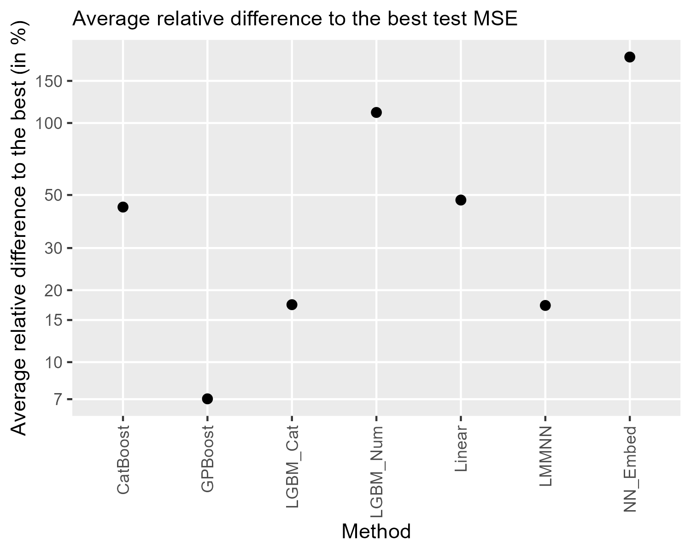

## Material for Sigrist (2023) - "A Comparison of Machine Learning Methods for Data with High-Cardinality Categorical Variables"

This repository contains material for reproducing the results of Sigrist (2023) - "A Comparison of Machine Learning Methods for Data with High-Cardinality Categorical Variables".

- [ETL](/ETL): code for preparing the data with instructions on where to download the data
- [data](/data): pre-processed data sets for modeling when the license of the original source permits it
- [run_experiments.R](run_experiments.R): code for running the experiments
- [results](/results): raw results
- [tune_pars](/tune_pars): chosen tuning parameters
- [cv_folds](/cv_folds): sample splits when doing cross-validation

See [Sigrist (2023)]() for more information.
